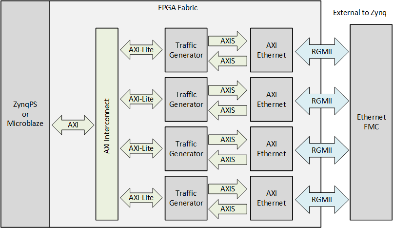

ethernet-fmc-max-throughput
===========================

Example design for the [Quad Gigabit Ethernet FMC](http://ethernetfmc.com "Ethernet FMC") using an FPGA based hardware
packet generator/checker to demonstrate maximum throughput.

## Requirements

This project is designed for version 2022.1 of the Xilinx tools (Vivado/SDK/PetaLinux). If you are using an older version of the 
Xilinx tools, then refer to the [release tags](https://github.com/fpgadeveloper/ethernet-fmc-max-throughput/releases "releases")
to find the version of this repository that matches your version of the tools.

In order to test the Ethernet FMC using this design, you need to use an
Ethernet cable to loopback ports 0 and 2, and ports 1 and 3.
You will also need the following:

* Vivado 2022.1
* Vitis 2022.1
* Vivado HLS 2022.1
* [Ethernet FMC](http://ethernetfmc.com "Ethernet FMC")
* Supported FMC carrier board (see list of supported carriers below)
* Two Ethernet cables
* [Xilinx Soft TEMAC license](http://ethernetfmc.com/getting-a-license-for-the-xilinx-tri-mode-ethernet-mac/ "Xilinx Soft TEMAC license")

## Supported carrier boards

* Zynq-7000 [ZedBoard](http://zedboard.org "ZedBoard")
  * LPC connector

## Description

This project is used for testing the [Quad Gigabit Ethernet FMC](http://ethernetfmc.com "Ethernet FMC") at
maximum throughput. The design contains 4 AXI Ethernet blocks and 4
hardware traffic generators. The transmitted frames contain fixed destination and source MAC addresses,
the Ethertype, a payload of random data and the FCS checksum.

## Build instructions

To use the sources in this repository, please follow these steps:

### Windows users

1. Download the repo as a zip file and extract the files to a directory
   on your hard drive --OR-- Git users: clone the repo to your hard drive
2. Open Windows Explorer, browse to the repo files on your hard drive.
3. In the HLS directory, double-click on the `build-hls-cores.bat` batch file.
4. In the Vivado directory, you will find multiple batch files (*.bat).
   Double click on the batch file that is appropriate to your hardware,
   for example, double-click `build-zedboard.bat` if you are using the ZedBoard.
   This will generate a Vivado project for your hardware platform.
5. Run Vivado and open the project that was just created.
6. Click Generate bitstream.
7. When the bitstream is successfully generated, select `File->Export->Export Hardware`.
   In the window that opens, tick "Include bitstream" and "Local to project".
8. Return to Windows Explorer and browse to the Vitis directory in the repo.
9. Double click the `build-vitis.bat` batch file. The batch file will run the
   `build-vitis.tcl` script and build the Vitis workspace containing the hardware
   design and the software application.
10. Run Xilinx Vitis and select the workspace to be the Vitis directory of the repo.
11. Connect and power up the hardware.
12. Open a Putty terminal to view the UART output.
13. In Vitis, select `Xilinx Tools->Program FPGA`.
14. Right-click on the application and select `Run As->Launch on Hardware (Single Application Debug)`

### Linux users

1. Download the repo as a zip file and extract the files to a directory
   on your hard drive --OR-- Git users: clone the repo to your hard drive
2. Launch the Vivado GUI.
3. Open the Tcl console from the Vivado welcome page. In the console, `cd` to the repo files
   on your hard drive and into the Vivado subdirectory. For example: `cd /media/projects/ethernet-fmc-max-throughput/Vivado`.
3. In the Vivado subdirectory, you will find multiple Tcl files. To list them, type `exec ls {*}[glob *.tcl]`.
   Determine the Tcl script for the example project that you would like to generate (for example: `build-zedboard.tcl`), 
   then `source` the script in the Tcl console: For example: `source build-zedboard.tcl`
4. Vivado will run the script and generate the project. When it's finished, click Generate bitstream.
5. When the bitstream is successfully generated, select `File->Export->Export Hardware`.
   In the window that opens, tick "Include bitstream" and "Local to project".
6. To build the Vitis workspace, open a Linux command terminal and `cd` to the Vitis directory in the repo.
7. The Vitis directory contains the `build-vitis.tcl` script that will build the Vitis workspace containing the hardware design and
   the software application. Run the build script by typing the following command: 
   `<path-of-xilinx-vitis>/bin/xsct build-vitis.tcl`. Note that you must replace `<path-of-xilinx-vitis>` with the 
   actual path to your Xilinx Vitis installation.
8. Run Xilinx Vitis and select the workspace to be the Vitis subdirectory of the 
   repo.
9. Connect and power up the hardware.
10. Open a Putty terminal to view the UART output.
11. In Vitis, select `Xilinx Tools->Program FPGA`.
12. Right-click on the application and select `Run As->Launch on Hardware (Single Application Debug)`

## Background

In order to test an Ethernet device at maximum throughput (back-to-back
packets at 1Gbps), one could setup the MACs to loopback to each other
and then send packets to each port from an external source such as a PC
which could compare the returned packets to the sent ones. However, it
is generally difficult to use a PC Ethernet port at full throughput,
because a PC typically has too many overheads which create a delay
between consecutive packets. For this reason, this design uses four
hardware packet generator/checkers that are implemented in the FPGA.
These generator/checkers drive the AXI Ethernet cores (the MACs) with a
continuous stream of packets. By using the FPGA to generate the Ethernet
packets, we are able to exploit almost 100% of the potential bandwidth.

## MAC Setup

The software application sets up the MACs in promiscuous mode which
allows them to pass through all packets, regardless of their destination
MAC address. It also sets them up to receive the FCS (checksum) from the
user design, rather than calculating and inserting it itself.

## Detecting Bit Errors

### Counting Dropped Frames

Due to the FCS (checksum) which is present in every Ethernet packet, most bit
errors that are injected into the system will result in dropped packets at
the receiving MAC (ie. the receiving MAC will reject packets where the FCS does
not match the frame data). Therefore, our primary method for detection of bit
errors involves polling the MACs for rejected frames. The number of rejected
frames is tracked by the software application.

To ensure that the MACs are truly rejecting frames with bit errors, we inject
one bit error into one packet per second, on all 4 ports. Our design supplies
the FCS to the transmit interface of the MACs, rather than having the MACs 
calculate and append the FCS. This allows us to inject a bit error that should
render the FCS incorrect for the frame.

## Ethernet Traffic Generator IP

The traffic generator IP was designed in Vivado HLS (High-level Synthesis) and is coded
in C++. Vivado HLS allows hardware algorithms to be programmed in the C/C++ language which
offers tremendous advantages over VHDL and Verilog, especially when developing packet processing 
systems. This example design serves as a good platform for developing Ethernet packet
processing algorithms with the Ethernet FMC.

## Simulation

The Ethernet Traffic Generator IP can be simulated in Vivado by using the RTL testbench that
is included with the project. The Vivado project contains two block designs, `maxtp` and `maxtp_sim`,
used for implementation and simulation respectively. The `maxtp_sim` block design contains one
instantiation of the Ethernet Traffic Generator IP (the DUT) and one AXI VPI IP core that we use to initialize the
software registers of the DUT. To run the simulation, simply open the Vivado project and select 
Run Simulation->Run Behavioral Simulation.

## Other applications

This design is actually used as a production test for the [Quad Gigabit Ethernet FMC](http://ethernetfmc.com "Ethernet FMC")
because it places maximum stress on the PHYs, which forces the maximum
current consumption, heat dissipation and possibility for cross-talk
between lanes. It can however be a very useful design for people who
need to communicate over Ethernet with another FPGA or an Ethernet
device that can support the high throughput.

## Troubleshooting

Check the following if the project fails to build or generate a bitstream:

### 1. Are you using the correct version of Vivado for this version of the repository?
Check the version specified in the Requirements section of this readme file. Note that this project is regularly maintained to the latest
version of Vivado and you may have to refer to an earlier commit of this repo if you are using an older version of Vivado.

### 2. Did you follow the Build instructions in this readme file?
All the projects in the repo are built, synthesised and implemented to a bitstream before being committed, so if you follow the
instructions, there should not be any build issues.

### 3. Did you copy/clone the repo into a short directory structure?
Vivado doesn't cope well with long directory structures, so copy/clone the repo into a short directory structure such as
`C:\projects\`. When working in long directory structures, you can get errors relating to missing files, particularly files 
that are normally generated by Vivado (FIFOs, etc).

## Contribute

We encourage contribution to these projects. If you spot issues or you want to add designs for other platforms, please
make a pull request.

## About us

This project was developed by [Opsero Inc.](http://opsero.com "Opsero Inc."),
a tight-knit team of FPGA experts delivering FPGA products and design services to start-ups and tech companies. 
Follow our blog, [FPGA Developer](http://www.fpgadeveloper.com "FPGA Developer"), for news, tutorials and
updates on the awesome projects we work on.
